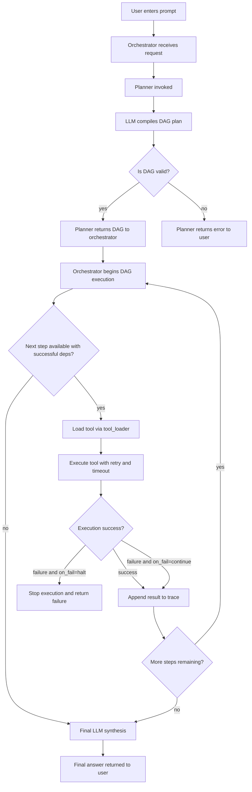
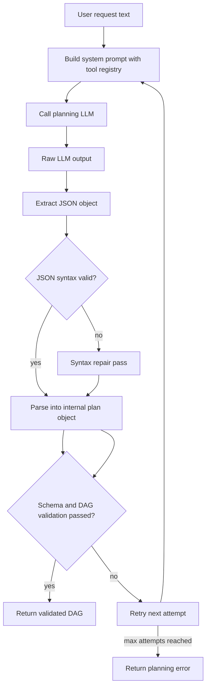
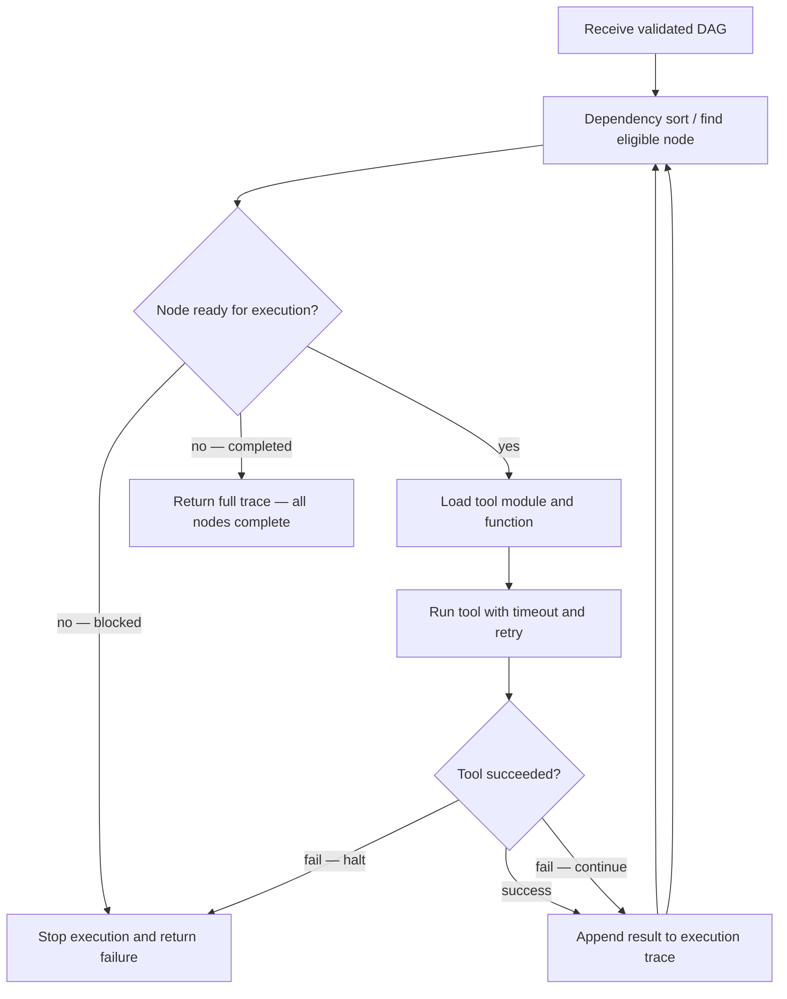
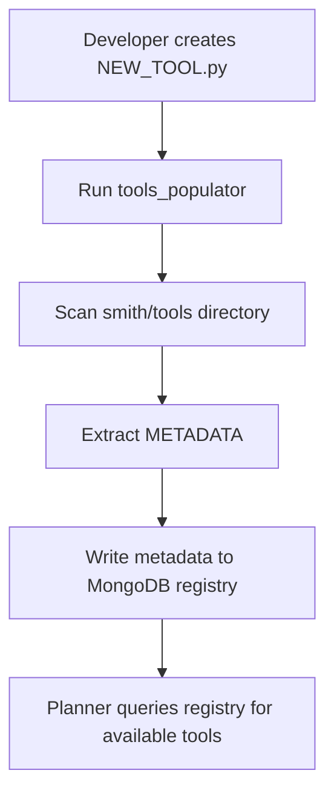
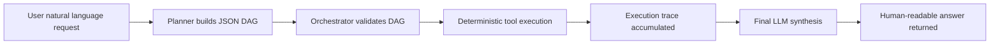

# Smith Architecture

Smith is a deterministic autonomous agent runtime. It transforms natural-language requests into a validated execution graph (DAG), executes tools in a controlled sequence, and uses an LLM only once at the end to synthesize the execution trace into a human‑readable answer.

At a high level, Smith behaves less like a chatbot and more like a compiler plus runtime:

* The **Planner** compiles the user’s prompt into a JSON DAG.
* The **Orchestrator** executes that DAG deterministically.
* **Tools** are stateless functions described by metadata.
* The **Final LLM** summarizes the trace but never controls execution.

---

## 1. Runtime Architecture — Request → Response

Smith is built around a deterministic execution pipeline. A natural‑language prompt does not directly trigger tool calls. Instead, Smith converts the request into a structured execution graph (DAG), validates it, then executes it step‑by‑step with full traceability.

The lifecycle follows four phases:

1. **Input** → User enters a natural‑language request.
2. **Planning** → Planner uses an LLM to compile a JSON DAG.
3. **Execution** → Orchestrator executes tools deterministically.
4. **Final Synthesis** → Final LLM converts the execution trace into a human output.

---

## 2. Planner Cycle — How a Prompt Becomes a DAG

The Planner behaves like a compiler — not an agent. It generates the execution plan once, and the Orchestrator executes it exactly as written. If the DAG cannot be validated, execution never begins.

**Planner responsibilities:**

* Build system prompt including the Tool Registry
* Call LLM for DAG generation
* Extract and sanitize JSON
* Validate schema + dependencies
* Retry on failure
* Return DAG or return planning error

---

## 3. Orchestrator Cycle — Deterministic Execution of the DAG

The Orchestrator is the runtime engine of Smith. It never calls an LLM for decision‑making and never improvises — it executes exactly the DAG the Planner produced.

---

## 4. Tool Lifecycle — How New Tools Become Usable

Tools are **plug‑and‑play** and require **no modification of the core engine**.

1. Developer creates a Python file in `smith/tools/`
2. Developer runs `python -m smith.tools_populator`
3. Populator extracts METADATA and registers it in MongoDB
4. Planner immediately sees the tool in the next planning cycle

---

## 5. Pipeline Summary & Core Principles

### 🔁 Smith Pipeline Summary

1. User enters request →
2. Planner builds DAG →
3. Orchestrator executes DAG →
4. Tools generate trace →
5. Final LLM generates answer

### 🧠 Core Principles

* **Determinism** — the same DAG always produces the same behavior.
* **Metadata‑Driven** — the engine does not "know" tools; it only reads their metadata.
* **Separation of Concerns** — planning, execution, and synthesis never overlap.
* **One‑Shot Planning** — LLM never participates during tool execution.
* **Fail‑Safety** — every tool has retry, timeout, and failure rules.
* **Security** — tools are stateless, isolated, and never invoked implicitly.

**Mental Model:**

* Planner = compiler
* Orchestrator = runtime
* Tools = system calls
* Final LLM = renderer, not controller
