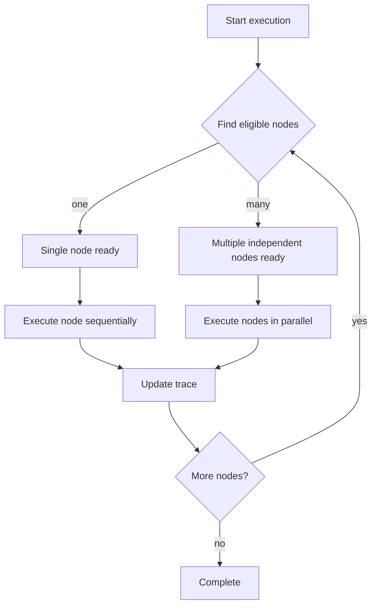

# Smith Orchestrator — Deterministic Runtime Engine

The Orchestrator is the runtime core of Smith. It takes a validated JSON DAG from the Planner and executes it exactly as defined. No improvisation, no hidden loops, no background prompting. If the Planner didn’t specify an action in the DAG, the Orchestrator will never run it.

---

### What the Orchestrator Does

At the highest level, the Orchestrator:

* reads the DAG
* determines which node is eligible for execution
* loads and calls the referenced tool function
* appends results to the execution trace
* continues until the DAG completes or fails

It is not an AI agent. It is a deterministic execution engine.

---

### How the Orchestrator Runs a DAG

The runtime loop is intentionally simple but strict:

1. Receive a validated DAG
2. Look for a node whose dependencies have all succeeded
3. Load the tool function using `tool_loader`
4. Execute the tool with timeout and retry rules
5. Write result to the execution trace
6. Repeat until:

   * all nodes are complete (success), or
   * a node fails with `on_fail = halt` (failure)

If no executable node exists but there are incomplete nodes, the DAG is considered blocked and execution stops.

---

### How Tools Are Loaded and Executed

The Orchestrator does not import tool files directly. Instead it delegates loading to `tool_loader`, which finds:

* the correct module inside `smith/tools/`
* the exact function specified in the DAG

This prevents filename or case sensitivity issues and eliminates hard‑coded imports. Tools are treated as isolated callables — the Orchestrator does not retain state between invocations.

---

### Retry, Timeout, and Failure Rules

Each node defines:

* `retry`: how many times to retry if the function raises an error
* `timeout`: max execution time in seconds
* `on_fail`: `halt` or `continue`

`halt`: immediately stops the entire run and returns failure
`continue`: logs the failure and moves on to other nodes

These rules ensure predictable behavior even when third‑party APIs fail.

---

### Execution Trace

Every tool call records:

* input arguments
* raw return value
* execution status
* timestamps and duration

The trace is the only context used by the final LLM synthesis. The trace is never rewritten or filtered.

---

### How Errors Propagate

The Orchestrator will stop the run when:

* a node fails with `on_fail = halt`, or
* the DAG reaches a blocked state (no remaining executable nodes)

If the run fails in either of these ways, the trace is still returned to the user for debugging.

---

### What to Modify vs What Not to Touch

Safe to modify:

* logging verbosity
* formatting of trace output
* retry/timeout defaults

Advanced changes (only when you understand consequences):

* concurrency or thread pooling
* dynamic scheduling strategies

Do not modify:

* execution ordering logic (DAG determinism would break)
* failure propagation rules
* tool loading resolution

---

### Summary

The Orchestrator:

* does not use an LLM
* does not guess what to do next
* does not alter the DAG
* does not retry planning

It runs exactly what the Planner wrote — no more, no less.

---

### How orchestration differs from LangChain, AutoGen, and similar frameworks

Smith does not treat language models as agents that decide the next step. Frameworks like LangChain and AutoGen often place the LLM in the control loop, meaning the model dynamically selects tools at runtime. Smith rejects that approach entirely. Planning is one-shot and frozen before execution begins. The Orchestrator never communicates with an LLM during execution and does not rely on textual reasoning for direction. It is closer to a job scheduler than an AI agent framework.

Key differences:

* Smith executes a compiled DAG; the model does not select the next tool.
* Smith runtime is deterministic; no probabilistic reasoning at execution time.
* Smith requires stateless tools with explicit parameter schemas instead of permissive signatures.
* Zero hidden loops or implicit re-prompting.

---

### Failure case examples and recovery paths

The Orchestrator does not attempt to interpret failure beyond the node’s policy. Behavior is fully controlled by `on_fail`.

Examples:

1. Tool timeout with `on_fail = halt`
   Execution stops immediately. The user receives a failure message along with the partial execution trace.

2. Tool timeout with `on_fail = continue`
   The failure is logged to the trace. Execution proceeds to the next eligible nodes.

3. DAG deadlock
   If no node is eligible to run and unexecuted nodes remain (dependency or failure block), execution terminates with a deadlock failure. This signals a planning issue or tool‑level inconsistency.

4. Final LLM node missing
   Treated as a DAG error. The Orchestrator skips synthesis and returns the raw trace. This should never occur with a valid plan.

---

---

### Parallel Execution

Smith supports parallel execution of independent DAG nodes to improve performance for workflows with fan-out patterns.

#### Execution Model

The orchestrator identifies nodes that can execute concurrently based on their dependencies:



#### Parallel Execution Criteria

Nodes execute in parallel when:
1. All dependencies have completed successfully
2. No shared resource locks are required
3. Multiple nodes meet criteria simultaneously

#### Implementation Details

**Thread Pool**: Uses ThreadPoolExecutor for concurrent tool execution.

**Rate Limiting**: Per-tool rate limits still apply, potentially serializing some parallel calls.

**Resource Locking**: Tools requiring the same resource execute serially even if otherwise independent.

**Sub-Agents**: Sub-agents always execute serially via global semaphore, regardless of DAG structure.

#### Performance Characteristics

**Best Case**: Fan-out patterns with independent tools (e.g., parallel API calls to different services).

```
Example DAG:
Node 0: google_search (no deps)
Node 1: finance_fetcher (no deps)
Node 2: weather_fetcher (no deps)
Node 3: llm_caller (depends on 0, 1, 2)

Nodes 0, 1, 2 execute in parallel.
Node 3 waits for all to complete.
```

**Worst Case**: Linear dependency chains execute sequentially regardless of parallel capability.

```
Example DAG:
Node 0: tool_a (no deps)
Node 1: tool_b (depends on 0)
Node 2: tool_c (depends on 1)

All nodes execute sequentially.
```

#### Configuration

Parallel execution is enabled by default. To disable:

```python
# In orchestrator configuration
ENABLE_PARALLEL_EXECUTION = False
```

#### Determinism Guarantees

Parallel execution maintains determinism:
- Same DAG produces same execution trace
- Node execution order within parallel batches may vary
- Final results are identical regardless of execution order
- Trace timestamps reflect actual execution timing

---

### Performance Tuning and Concurrency

The Orchestrator balances performance with determinism through several mechanisms:

**Sequential Fallback**: When parallel execution is disabled or unavailable, the orchestrator falls back to sequential execution.

**Resource Quotas**: Per-tool resource quotas prevent any single tool from monopolizing system resources.

**Distributed Execution**: Future work may support distributed execution of compute-heavy tools across multiple machines.

**Lock-Free Logging**: Trace logging uses thread-safe data structures to support high-throughput parallel execution.

**Concurrency Limits**: Maximum concurrent tool executions can be configured:

```python
# In orchestrator configuration
MAX_CONCURRENT_TOOLS = 5  # Maximum parallel tool executions
```

Even with parallel scheduling, LLM calls remain outside the runtime loop. Determinism and replayability remain non-negotiable guarantees.

