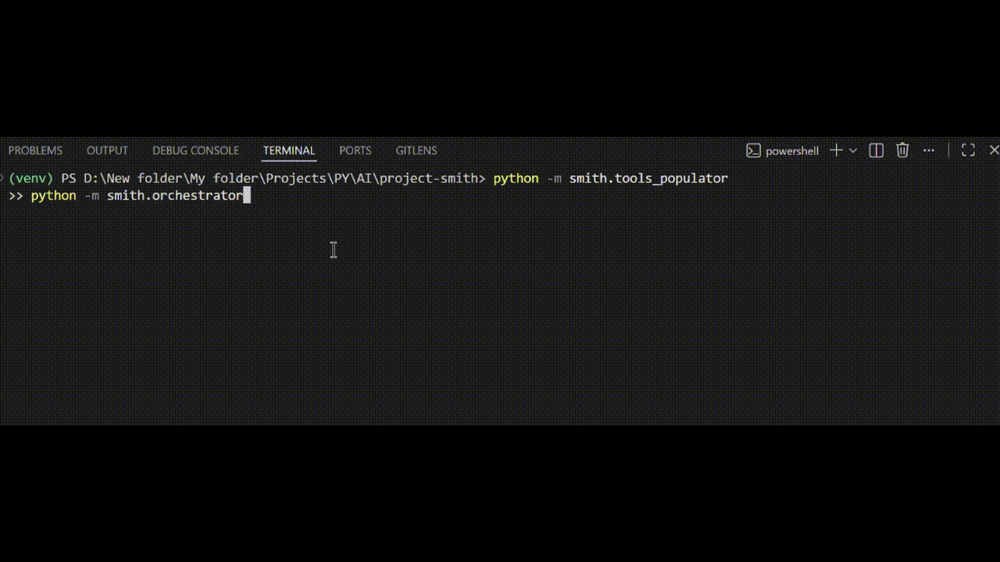
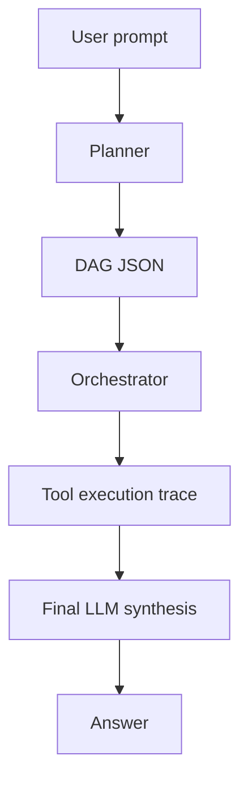
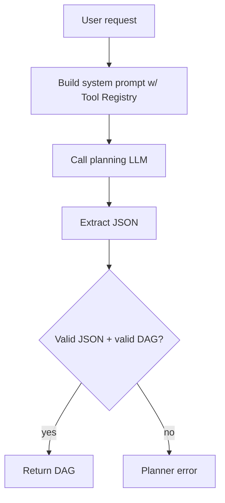
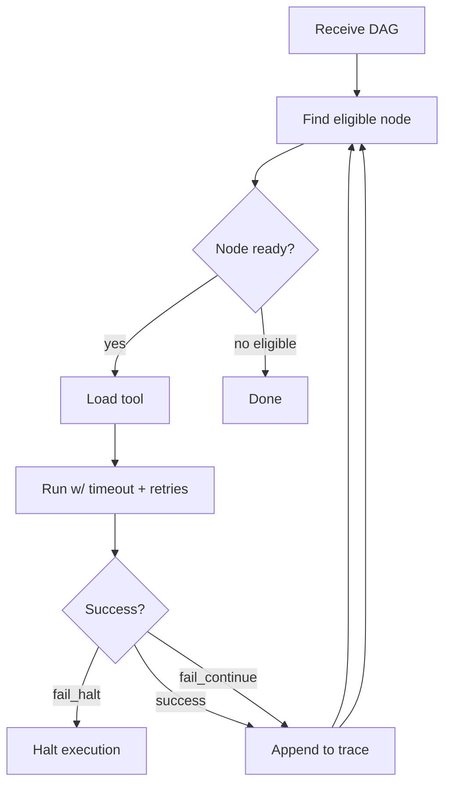
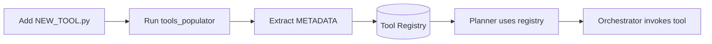
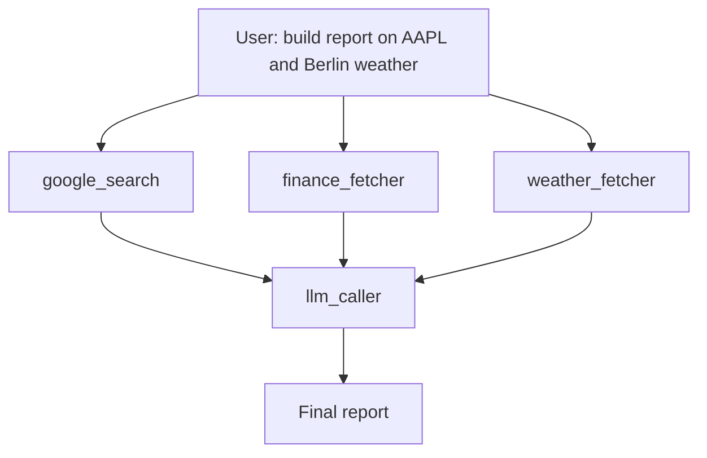

# Smith — Zero‑Trust Autonomous Agent Runtime

**Write tools, not chains — Smith handles DAG, retries, orchestration, and final LLM synthesis.**

<p align="center"></p>

[](https://www.python.org/)
[](./LICENSE)
[](./)

---

## Overview
Smith is a deterministic autonomous agent runtime. It converts natural‑language requests into a JSON execution graph (DAG), executes stateless tools with retries and timeouts, and performs a single final LLM synthesis using the execution trace.

There are **no hidden loops**, **no reactive mid‑execution prompting**, and **no improvisation**. Smith is designed for reliability, debugging, and extensibility.

### Core Concepts
| Component | Responsibility |
|----------|----------------|
| Planner | Compiles user intent → JSON DAG |
| Orchestrator | Executes DAG deterministically |
| Tools | Stateless functions described strictly by METADATA |
| Final LLM | Renders output using execution trace only |

---

## Quickstart
```bash
git clone https://github.com/Karunya-Muddana/project-smith.git
cd project-smith

python -m venv venv
# Windowsenv\Scripts\activate
# Mac/Linux
source venv/bin/activate

pip install -r requirements.txt

docker compose up -d  # start MongoDB locally

python -m smith.tools_populator   # populate tool registry
python -m smith.orchestrator      # launch CLI runtime
```

Example prompt to run inside CLI:
```
google_search latest AI trends; then llm_caller summarize
```

---

## Runtime Architecture



---

## Planner Cycle


Planner enforces:
* Parameter names must match METADATA exactly
* All depends_on references must exist
* `final_output_node` must be defined

---

## Orchestrator Cycle


Execution is always deterministic: the same DAG always produces the same behavior.

---

## Tool Lifecycle


A tool becomes available simply by:
1. Creating a `.py` file in `smith/tools/`
2. Defining a function
3. Adding a `METADATA` dict
4. Running `python -m smith.tools_populator`

No engine changes required.

---

## Full Example DAG


---

## Usage Examples
Simple:
```
google_search "latest AI trends"; then llm_caller summarize
```
Multi‑tool:
```
google_search "top tech companies in Germany";
weather_fetcher Berlin;
finance_fetcher price AAPL;
then llm_caller combine into investment report
```

---

## Developer Documentation
The full technical specifications live in the `docs/` directory:

| File | Purpose |
|------|---------|
| planner.md | DAG rules, validation, retry logic |
| orchestrator.md | runtime semantics, failure recovery |
| tools-spec.md | METADATA schema and safety guidelines |
| troubleshooting.md | real error → meaning → fix guide |

---

## Troubleshooting
If planning fails:
```
python -m smith.tools_populator  # registry refresh
```
Check that generated JSON contains nodes[] and final_output_node.

If execution halts:
Inspect the trace printed by the orchestrator; look for a failed node and its on_fail policy.

More: `docs/troubleshooting.md`

---

## Contributing & License
Pull requests welcome. Rules:
* Tools must be stateless
* METADATA must be accurate
* No long‑running operations without timeouts

Licensed under the MIT License — see `./LICENSE`.

---

## Credits
Created and maintained by **Karunya Muddana**
BTech Computer Science — AI/ML & MLOps

LinkedIn: https://www.linkedin.com/in/karunya-muddana/

Project direction, architecture, planner/orchestrator design, docs, and pipeline automation authored and maintained by Karunya.
